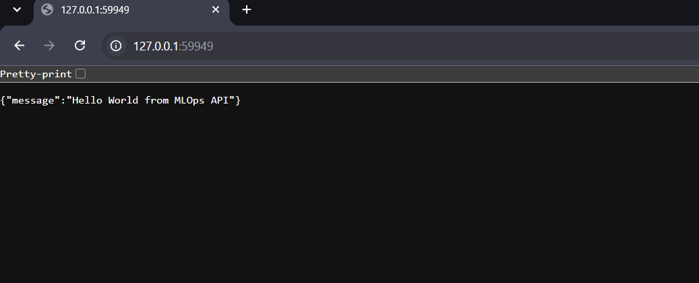
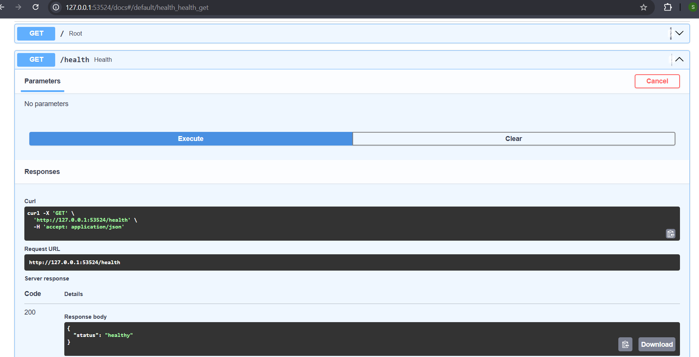

# MLOps Helm Platform

A small, reusable deployment setup for a sample Python API using Docker, Kubernetes, Helm, Terraform, and GitHub Actions.

The main idea of this project is simple: **use one generic Helm chart for multiple environments instead of maintaining separate Kubernetes manifests for Dev, Staging, and Production.**

Environment-specific differences are kept in separate values files, while the Kubernetes deployment logic stays common.

---

## Project Goal

The goal was to build a Helm-based deployment setup that can:

* Deploy a sample Python API on a local Kubernetes cluster
* Use the same generic Helm chart across environments
* Keep Dev, Staging, and Production configuration separate
* Validate and test the Helm chart
* Package and publish the Helm chart through CI/CD
* Handle secrets without committing actual secret values to Git
* Support autoscaling for higher environments
* Show how the Helm deployment could be managed through Terraform

The project is intentionally small. The focus is on the **deployment approach, reusability, automation, and operational thinking**, rather than building a complex ML application.

---

## High-Level Flow

```text
                    Developer
                        |
                        v
                  GitHub Repository
                        |
                        v
                 GitHub Actions
                        |
              +---------+---------+
              |                   |
              v                   v
          Helm Lint           Helm Render
              |                   |
              +---------+---------+
                        |
                        v
                 Package Helm Chart
                        |
             +----------+----------+
             |                     |
             v                     v
       GitHub Artifact        Private GHCR
                                    |
                                    v
                              Helm OCI Chart


Local Deployment:

Python API
    |
    v
Docker Image
    |
    v
Generic Helm Chart
    |
    +---- Dev
    |
    +---- Staging
    |
    +---- Production
    |
    v
Kubernetes / Minikube
    |
    v
Service
    |
    v
Local PC / Swagger UI
```

---

## Why Helm?

If each environment had its own Kubernetes YAML files, the deployment configuration would quickly become duplicated and harder to maintain.

Instead, this project uses:

```text
One Helm Chart
      +
Different values files
```

The common deployment logic stays in the templates.

Environment-specific settings are changed through:

```text
values-dev.yaml
values-staging.yaml
values-prod.yaml
```

This makes the chart reusable and keeps environment differences explicit.

---

## Repository Structure

```text
mlops-helm-platform/
│
├── app/
│   ├── app.py
│   ├── requirements.txt
│   ├── Dockerfile
│   └── .dockerignore
│
├── helm/
│   └── ml-api/
│       ├── Chart.yaml
│       ├── values.yaml
│       ├── values-dev.yaml
│       ├── values-staging.yaml
│       ├── values-prod.yaml
│       └── templates/
│           ├── deployment.yaml
│           ├── service.yaml
│           ├── hpa.yaml
│           ├── serviceaccount.yaml
│           ├── _helpers.tpl
│           └── tests/
│               └── test-connection.yaml
│
├── terraform/
│   ├── main.tf
│   ├── variables.tf
│   └── outputs.tf
│
└── .github/
    └── workflows/
        └── helm-ci-cd.yml
```

---

# 1. Sample Python API

The application is a small FastAPI service.

The API is intentionally simple because the main focus of this assignment is the Kubernetes and Helm deployment.

The main health endpoint is:

```text
GET /health
```

Expected response:

```json
{
  "status": "healthy"
}
```

FastAPI also provides Swagger UI for testing the API:

```text
/docs
```

---

# 2. Docker

The application is packaged as a Docker image so that the same application can run consistently inside Kubernetes.

Build the image:

```bash
docker build -t ml-api:1.0.0 ./app
```

The Docker image contains:

* FastAPI application
* Python dependencies
* Application runtime configuration

For local testing, the image is used with Minikube.

---

# 3. Generic Helm Chart

The reusable Helm chart is located at:

```text
helm/ml-api/
```

The chart contains common Kubernetes templates for the application.

The main templates are:

```text
deployment.yaml
service.yaml
hpa.yaml
serviceaccount.yaml
```

The helper template:

```text
_helpers.tpl
```

keeps naming and labels consistent across Kubernetes resources.

For example, the same chart can be deployed with different release names:

```bash
helm upgrade --install ml-api-dev ./helm/ml-api \
  -f ./helm/ml-api/values-dev.yaml
```

and:

```bash
helm upgrade --install ml-api-prod ./helm/ml-api \
  -f ./helm/ml-api/values-prod.yaml
```

The Kubernetes templates remain the same. Only the environment-specific values change.

This is the main reusable design decision in the project.

---

# 4. Environment Configuration

The chart supports three environments.

| Environment | Replicas | Service Type | Autoscaling |
| ----------- | -------: | ------------ | ----------- |
| Dev         |        1 | NodePort     | Disabled    |
| Staging     |        2 | ClusterIP    | Enabled     |
| Production  |        3 | ClusterIP    | Enabled     |

The exact configuration is maintained in:

```text
values-dev.yaml
values-staging.yaml
values-prod.yaml
```

This keeps environment-specific configuration outside the common templates.

For example, Dev is kept lightweight for local testing, while Staging and Production start with more replicas and use autoscaling.

---

# 5. Deploy on Local Minikube

The chart was tested on Minikube.

Start Minikube:

```bash
minikube start
```

Deploy the Dev environment:

```bash
helm upgrade --install ml-api-dev ./helm/ml-api \
  -f ./helm/ml-api/values-dev.yaml
```

Check the deployment:

```bash
kubectl get pods
kubectl get svc
```

A healthy deployment should show the application Pod in `Running` state.

Example:

```text
ml-api-dev-xxxxx   1/1   Running
```

---

# 6. Access the API from Local PC

For local access, port forwarding is used because it gives a predictable URL.

Run:

```bash
kubectl port-forward svc/ml-api-dev 8000:80
```

Then open Swagger UI:

```text
http://127.0.0.1:8000/docs
```

Health endpoint:

```text
http://127.0.0.1:8000/health
```

Expected response:

```json
{
  "status": "healthy"
}
```

The port-forward command needs to remain running while the API is being accessed.

This provides a simple way to prove that the application deployed through Helm is actually callable from the local PC.

---

# 7. Helm Validation

Before deploying, the chart can be checked with Helm lint:

```bash
helm lint ./helm/ml-api \
  -f ./helm/ml-api/values-dev.yaml

helm lint ./helm/ml-api \
  -f ./helm/ml-api/values-staging.yaml

helm lint ./helm/ml-api \
  -f ./helm/ml-api/values-prod.yaml
```

The chart is also rendered to verify the Kubernetes manifests generated by Helm.

Example:

```bash
helm template ml-api-dev ./helm/ml-api \
  -f ./helm/ml-api/values-dev.yaml
```

The same validation is also performed by the GitHub Actions workflow.

---

# 8. Helm Test Cases

The chart contains a Helm test:

```text
helm/ml-api/templates/tests/test-connection.yaml
```

After deploying the chart:

```bash
helm test ml-api-dev
```

The test checks the deployed application/service and verifies that the health endpoint responds successfully.

The test was executed successfully:

```text
Phase: Succeeded
```

The reason for having a Helm test is that a Pod being `Running` does not always mean that the application itself is working. The test gives an additional post-deployment check.

---

# 9. Health Checks

The Deployment uses both readiness and liveness probes.

Both probes use:

```text
/health
```

### Readiness Probe

The readiness probe tells Kubernetes whether the application is ready to receive traffic.

### Liveness Probe

The liveness probe helps Kubernetes detect if the application has become unhealthy.

So the flow is:

```text
Application starts
       |
       v
/health check
       |
       +---- Not ready → Kubernetes does not send traffic
       |
       +---- Healthy → Pod receives traffic
```

---

# 10. Autoscaling

Autoscaling is enabled for Staging and Production using Kubernetes Horizontal Pod Autoscaler (HPA).

The idea is to increase the number of Pods when the application needs more capacity.

```text
Higher CPU usage
       |
       v
HPA detects increased utilization
       |
       v
More Pods are created
       |
       v
Traffic can be distributed across more Pods
```

Staging and Production have different scaling settings so that each environment can have its own capacity policy.

The HPA configuration is controlled through the environment-specific values files.

---

# 11. Kubernetes Security

A few basic security settings are included in the Deployment.

The application runs as a non-root user.

Privilege escalation is disabled.

The ServiceAccount token is not automatically mounted when it is not required.

These settings reduce unnecessary privileges for the application container.

The intention is to follow a basic least-privilege approach even for a small sample application.

---

# 12. Secrets Handling

Actual secret values should never be committed to the Git repository.

The Helm chart includes support for Kubernetes Secret configuration.

The important separation is:

```text
Helm template
     |
     v
Secret definition
     |
     v
Actual secret value supplied at deployment/runtime
```

The repository contains the deployment logic, but not real credentials or secret values.

For a production setup, I would prefer an external secret-management solution such as:

```text
Cloud Secret Manager
        |
        v
External Secrets / Kubernetes Secret
        |
        v
Application
```

This keeps sensitive values outside the source repository.

---

# 13. Terraform / Infrastructure as Code

The project also contains a small Terraform example:

```text
terraform/
```

Terraform uses the Helm provider to show how the same Helm chart could be deployed through Infrastructure as Code.

The purpose here is to demonstrate the deployment approach. It is not intended to create a complete cloud infrastructure because the assignment does not require a live cloud deployment.

Validate the Terraform configuration:

```bash
cd terraform
terraform init
terraform validate
```

The Terraform configuration was validated successfully.

The basic idea is:

```text
Terraform
    |
    v
Helm Provider
    |
    v
Helm Chart
    |
    v
Kubernetes
```

---

# 14. GitHub Actions CI/CD

The CI/CD workflow is:

```text
.github/workflows/helm-ci-cd.yml
```

The workflow runs for relevant changes to the Helm chart or workflow file.

The pipeline performs the following steps:

```text
Git Push / Pull Request
          |
          v
       Checkout
          |
          v
       Setup Helm
          |
          v
       Helm Lint
          |
          v
   Render Dev/Staging/Prod
          |
          v
     Package Chart
          |
          v
   Upload Build Artifact
          |
          v
       Login to GHCR
          |
          v
   Push Helm Chart to GHCR
```

### Helm Lint

All three environment values files are checked.

### Render

The chart is rendered for:

```text
Dev
Staging
Production
```

This helps catch Helm templating or values-related issues before deployment.

### Package

The chart is packaged into a `.tgz` Helm package.

Example:

```text
ml-api-0.1.0.tgz
```

### Artifact

The packaged chart is also uploaded as a GitHub Actions artifact.

### Publish

On the `main` branch, the packaged Helm chart is pushed to a private GHCR registry as an OCI artifact.

The workflow uses:

```yaml
permissions:
  contents: read
  packages: write
```

and the GitHub Actions token for registry authentication.

No personal registry password is stored in the workflow.

---

# 15. Private GHCR

The Helm chart is published to GitHub Container Registry (GHCR).

The package is kept private.

The publishing flow is:

```text
Helm Chart
    |
    v
helm package
    |
    v
ml-api-0.1.0.tgz
    |
    v
Helm OCI Push
    |
    v
Private GHCR
```

This provides a versioned location from which the packaged Helm chart can be consumed later.

---

# 16. Version Control

Git is used for source-code version control.

The repository contains:

```text
Application code
Helm chart
Environment values
Terraform configuration
CI/CD workflow
Documentation
```

Changes are committed to Git and pushed to GitHub.

Helm also has its own chart versioning.

Current versions:

```text
Application version: 1.0.0
Helm chart version:   0.1.0
```

The application version and Helm chart version are kept separate.

For example, a change to Kubernetes templates may require a new chart version even if the application code has not changed.

This makes application releases and deployment configuration changes easier to track.

---

# 17. Why This Design?

There are a few design choices I intentionally made in this project.

### One chart instead of three charts

I don't want Dev, Staging, and Production to become three copies of the same Kubernetes manifests.

One chart keeps the deployment logic common.

### Values for environment differences

Replica counts, service type, resources, autoscaling and other environment-specific settings belong in values files.

This makes the differences visible without changing the templates.

### Validate before deployment

Helm lint and Helm template are used to catch configuration issues early.

The same checks are also part of CI/CD.

### Test after deployment

`helm test` gives an application-level check instead of relying only on Kubernetes Pod status.

### Keep secrets out of Git

The repository should contain how a secret is used, not the actual secret value.

### Keep the infrastructure example small

Terraform is included to demonstrate how the Helm deployment can fit into an IaC workflow without pretending that a complete cloud environment is required for this assignment.

---

# 18. Assignment Requirements Coverage

| Requirement                   | Implementation                                               |
| ----------------------------- | ------------------------------------------------------------ |
| Generic Helm Chart            | One reusable `ml-api` chart                                  |
| Local Minikube deployment     | Tested using Minikube                                        |
| ML API callable from local PC | Port-forward + Swagger UI                                    |
| Helm test cases               | `test-connection.yaml` + `helm test`                         |
| CI/CD                         | GitHub Actions                                               |
| Build Helm Chart              | `helm package`                                               |
| Publish Helm Chart            | Private GHCR OCI registry                                    |
| Rich README                   | This document                                                |
| IaC snippet                   | Terraform + Helm provider                                    |
| Auto Scaling                  | HPA for Staging and Production                               |
| Version Control               | Git + Helm chart versioning                                  |
| Secret handling               | Kubernetes Secret support + runtime/external secret approach |
| Security                      | Non-root container + restricted privilege settings           |

---

# 19. Useful Commands

### Start Minikube

```bash
minikube start
```

### Deploy Dev

```bash
helm upgrade --install ml-api-dev ./helm/ml-api \
  -f ./helm/ml-api/values-dev.yaml
```

### Check Pods

```bash
kubectl get pods
```

### Check Services

```bash
kubectl get svc
```

### Check Helm Release

```bash
helm list
```

### Run Helm Test

```bash
helm test ml-api-dev
```

### Port Forward

```bash
kubectl port-forward svc/ml-api-dev 8000:80
```

### Open Swagger

```text
http://127.0.0.1:8000/docs
```

### Check Health

```text
http://127.0.0.1:8000/health
```

### Validate Helm

```bash
helm lint ./helm/ml-api \
  -f ./helm/ml-api/values-dev.yaml
```

### Render Helm

```bash
helm template ml-api-dev ./helm/ml-api \
  -f ./helm/ml-api/values-dev.yaml
```

### Validate Terraform

```bash
cd terraform
terraform validate
```

---

# 20. Final Project Flow

The complete idea behind the project is:

```text
                    Source Code
                        |
                        v
                  GitHub Repository
                        |
                        v
                 GitHub Actions
                        |
              +---------+---------+
              |                   |
              v                   v
          Helm Lint          Helm Render
              |                   |
              +---------+---------+
                        |
                        v
                 Package Helm Chart
                        |
                        v
                    Private GHCR
                        |
                        v
                 Versioned Helm Chart
                        |
                        v
                    Kubernetes
                        |
          +-------------+-------------+
          |             |             |
          v             v             v
         Dev         Staging        Prod
          |             |             |
          |             +---- HPA -----+
          |
          v
     Local Minikube
          |
          v
     ML API Service
          |
          v
   Local PC / Swagger UI
          |
          v
      Helm Test
```

The key idea is to keep the deployment **reusable, environment-aware, testable, and automated** without making the project more complicated than the actual requirement.

For a real production implementation, the same approach could be extended with managed Kubernetes, external secret management, image scanning, monitoring, GitOps-based deployment, and cloud authentication through OIDC.

## Validation Evidence

### Local ML API Response

The ML API was successfully deployed on Minikube and verified through the local Swagger API.



### Health Check

The `/health` endpoint returned a healthy status successfully.


